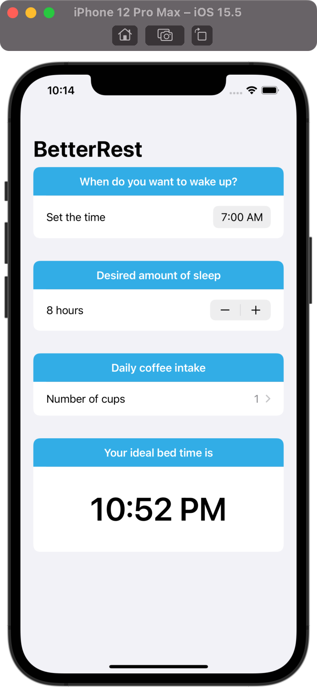

# BetterRest

## Project Description

The project is a part of 100 Days of SwiftUI curriculum by Paul Hudson [Hacking with swift](https://www.hackingwithswift.com/100/swiftui)

The app is designed to help coffee drinkers get a good night’s sleep by asking them three questions:

1. When do they want to wake up?
2. Roughly how many hours of sleep do they want?
3. How many cups of coffee do they drink per day?

Once we have those three values, we’ll feed them into Core ML to get a result telling us when they ought to go to bed.

## Project Screen

